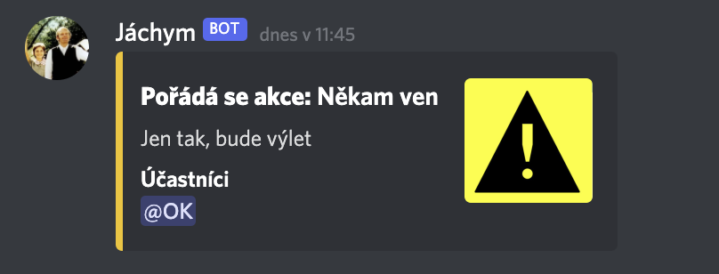

<h1 align=center>
 
    Jáchym 🤖

</h1>

<h2 align=center>
Open-source skautský discord bot postavený na
<a href="https://discordpy.readthedocs.io/en/stable/">discord.py</a>
</h2>

  <a href="##about?">O čem?</a>
  •
  <a href="#feat">Funkce</a>
  •
  <a href="##todo">TODO</a>
  •
  <a href="#cred">Poděkování</a>

### ❓ O čem?

___

Jáchym vznikl jako projekt do [odborky](https://odborky.skaut.cz/ajtak/) před cca pěti měsíci. Od té doby je pořád ve
vývoji pro potřeby Potkaního skautského oddílu. Nyní ho dávám opensource, protože proč prostě ne. Pro pozvání Jáchyma na
váš server použijte tento
[odkaz](https://discord.com/api/oauth2/authorize?client_id=784879308288163840&permissions=1275259968&scope=bot).
Samozřejmě taky můžete napsat issues nebo na discordu The Xero#1273, každý názor uvítám a bude jedině dobře pokud se
tímto zlepší Jáchym. Way to go!

#### Proč Jáchyma pozvat na server?

Podpoříte tím mně jakožto developera, který se dlouho snažil o nějaký opensource projekt. Za každou zpětnou vazbu,
podporu a návrhy budu velice vděčný. Tento projekt dělám ve svém volném čase a myslím si, že má význam ho dávat
opensource. Jeden z důvodů, proč jsem také dělal Jáchyma byl ten, že čím dál tím víc oddílu přechází na discord jakožto
hlavní komunikační platformu. Discord jako takový je skvělý, jen na něm nám scházelo pár věcí, které dělá právě Jáchym.

Když se Vám líbí toto repo, nezapomeňte dát hvězdičky! ⭐⭐⭐⭐

### 🤖 Funkce

___

`command_prefix` je klasika `!`

Jáchym má nyní pár funkcí, z nichž jsou dvě stěžejní pro chod a komunikaci oddílu.

* 📊 `anketa` - Příkaz pro anketu, momentálně podporuje maximálně 10 odpovědí. Zobrazí jména i počet hlasujících.

* ⚠️ `udalost` - Příkaz pro jednorázovou událost, funguje na podobném principu jako `anketa`, s tím rozdílem, že se tam
  hlasuje o to, kdo jede na tu událost a kdo ne. Na přesně tom dni se potom označí uživatelé, že jim nějaký event
  začíná.

* 🎉 Pak jsou další fun commandy jako `zasifruj` a `desifruj`, který přeloží daný text do morseovky. Další commandy
  najdete v `!help`, který se snažím udržovat co nejaktuálnější.

### 📝 To-Do

___

Protože je Jáchym stále ve procesu developementu, jsou věci, které jsou třeba dodělat. Momentálně to jsou tyto věci:

- [ ] Komentáře ve kódu, sepsat jak příkazy fungují
- [ ] Lépe pořešit tabulky v databázi a relace mezi nimi. Vyvarovat se opakování záznamů
- [ ] Statistiky serveru přes matplot nebo jiný modul
- [ ] Json-ify vše (vlastní text místo toho hardcoded)
- [ ] Fun commands?
- [ ] Vlastní R-Pi server místo toho, který momentálně užívám
- [ ] Napsat dokumentaci jak mít self-hosted bota.
- [ ] Napsat dokumentaci pro Jáchyma, chybí tam vysvětlení u některých kódů
- [ ] PRIVACY POLICY!!! Hodně důležitá věc, uvědomil jsem si, že můžou být problémy s GDPR a ochranou osobních údajů. DOPLNIT!!!

...další přibudou, až mě napadnou další věci, co budou potřeba udělat. Pokud si myslíte že něco není v pořádku a je to
potřeba upravit, neváhejte napsat do issues.

### Licence

___

Je to pod MIT licencí.

### 📜 Poděkování

___

* Oříškovi, který mi pomohl s Pythonem a uvedl mi tak nový svět informatiky.

### A protože...

...se tento bot jmenuje Jáchym, zanechávám hlášku z filmu! 

Béda: „Hele, já jsem jí včera, to my to ještě myslelo, složil básničku.” (odkašle si a recituje) „Růže - k lásce schůdeček, s úctou Béda Hudeček...”
František: „Teda, to jsi složil sám? Teda, to jsi hotovej ten... básník...”
